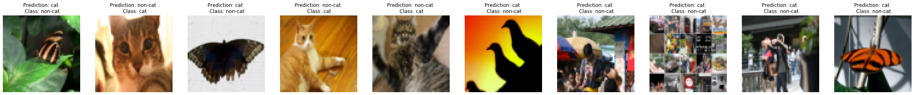

# Deep Neural Network

In this I have classified images as cats and non-cats. The accuracy for 2 layer network was 99.99% on training data and 70% on testing data. And the accuracy for 5 layer network was 98.5% on training data and 80% on testing data.

## Mislabelled Images

