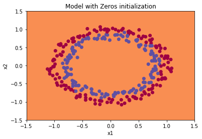
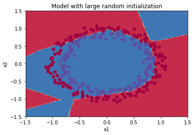
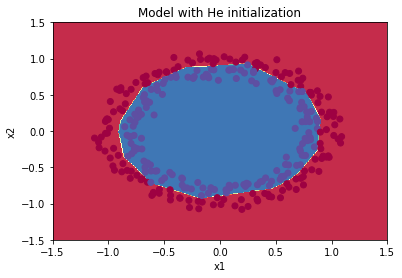

# Initialization of parameters (weights and biases)

* ## Zero Initialization  
  
The training set accuracy was 50% and the testing set accuracy was 50% 

* ## Random Initialization  
    
The training set accuracy was 83% and the testing set accuracy was 86%  

* ## He initialization   
  
The training set accuracy was 99.33% and the testing accuracy was 96%
