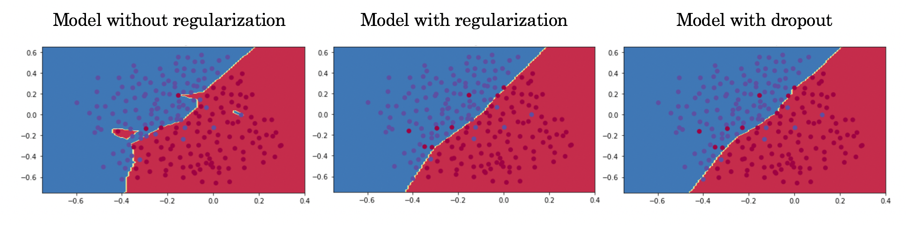

# Regularization

* The training accuracy for the first non - regularized overfitted model is **94.7%** and testing accuracy is **91.5%**.  
* The second model with **L2 regularization** has training accuracy of **93.8%** and testing accuracy of **93%**.  
* The third model has **dropout** implemented and has training accuracy of **92.8%** and testing accuracy of **95%**.  
