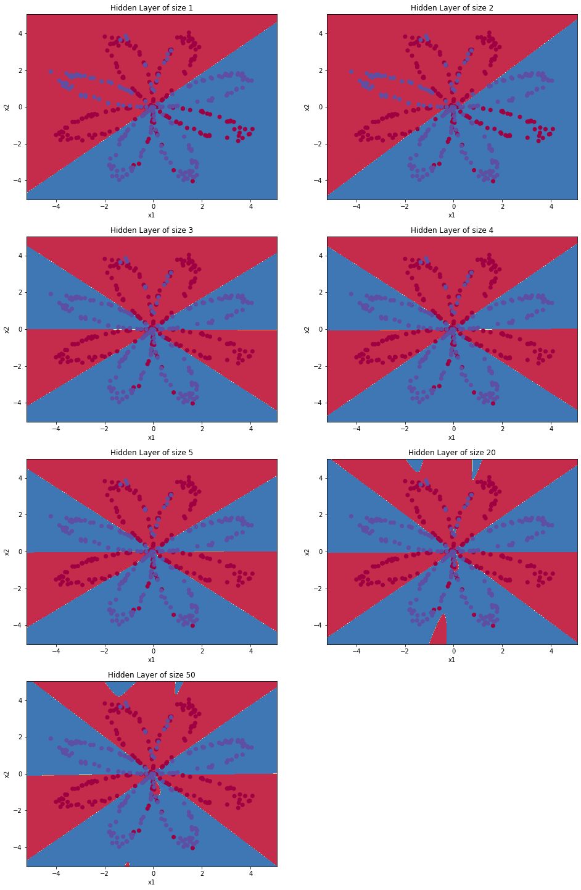

# Simple Neural Network
This is the implementation of a Shallow Neural Network with only one hidden layer and binary classified output.  

This is the output classification for a hidden layer with different number of units.   

